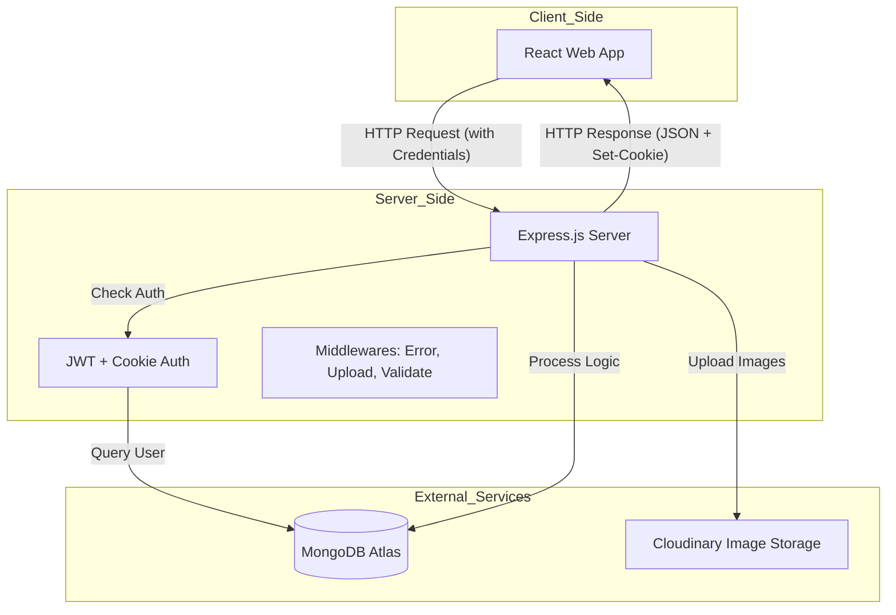
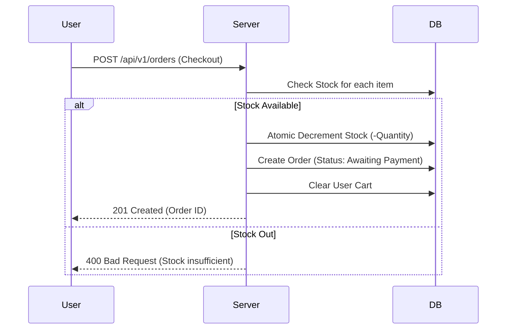

# System Design - Project Jamine

เอกสารนี้อธิบายโครงสร้างระบบ (Architecture) และการไหลของข้อมูล (Data Flow) ของโปรเจกต์ Backend Jamine เพื่อให้เห็นภาพรวมก่อนเริ่มพัฒนา Frontend

---

## 🏗️ 1. System Architecture (ภาพรวมระบบ)

ระบบนี้ใช้สถาปัตยกรรมแบบ **Client-Server** โดยมีส่วนประกอบหลักดังนี้:

---

## 🔄 2. Data Flow (การไหลของข้อมูล)

### **2.1 Authentication Flow (ระบบล็อกอิน)**
1. **User** ส่ง Email/Password มาที่ `/api/v1/users/login`
2. **Server** ตรวจสอบรหัสผ่าน (Bcrypt)
3. **Server** สร้าง JWT Token
4. **Server** ส่งกลับ JSON พร้อมตั้งค่า **HttpOnly Cookie** ในเบราว์เซอร์
5. **Frontend** ไม่ต้องเก็บ Token ใน LocalStorage (ปลอดภัยกว่า)

### **2.2 Order & Inventory Flow (ระบบสั่งซื้อและตัดสต็อก)**
ระบบมีการจัดการสต็อกแบบ **Atomic Operation** เพื่อป้องกันการซื้อตัดหน้า:

---

## 🗄️ 3. Database Schema (โครงสร้างฐานข้อมูล)

เราใช้ **MongoDB** ในการเก็บข้อมูล โดยมี Model หลักๆ ดังนี้:

- **Users:** เก็บข้อมูลโปรไฟล์, Role, และ Address List
- **Products:** เก็บรายละเอียดสินค้า, หมวดหมู่, สต็อก และ URL รูปภาพจาก Cloudinary
- **Carts:** เก็บรายการสินค้าที่ User เลือกไว้ (1 User : 1 Cart)
- **Orders:** เก็บประวัติการสั่งซื้อ, สถานะชำระเงิน, และข้อมูลที่อยู่ขณะสั่งซื้อ (Snapshot)

---

## 🛡️ 4. Security & Performance
- **Security:** ใช้ `helmet` (แนะนำให้ติดเพิ่ม), `cors` จำกัด Origin, และ `HttpOnly Cookie` เพื่อป้องกัน XSS
- **Performance:** ใช้ `.lean()` ในการ Query ข้อมูลที่ไม่ได้แก้ไขเพื่อประหยัด RAM และใช้ `BulkWrite` ในการอัปเดตสต็อกหลายรายการพร้อมกัน
- **Image Management:** รูปภาพทั้งหมดถูกเก็บที่ **Cloudinary** โดยเซิร์ฟเวอร์จะเก็บเพียง URL เพื่อลดภาระของ Database

---

## 🛠️ 5. Deployment Tech Stack
- **Backend:** Node.js (Express)
- **Database:** MongoDB Atlas (Cloud)
- **Storage:** Cloudinary (CDN)
- **Hosting:** Render / Railway (Suggested)
